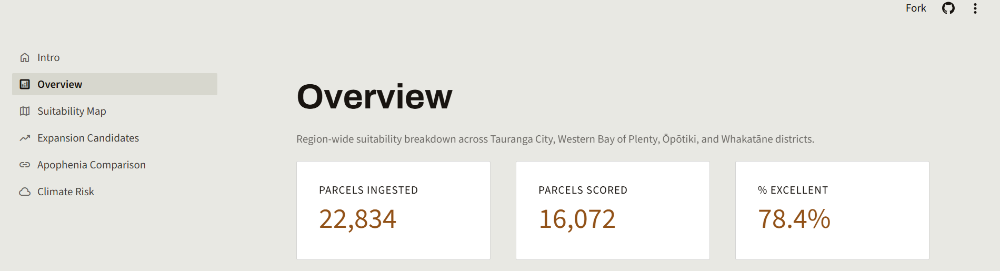

# Terroir



[](https://github.com/gabrielaoliveranz/horticultural-land-suitability-nz/actions/workflows/tests.yml)

Geospatial land-suitability analysis for Bay of Plenty horticulture — the sister project to [Apophenia](https://apophenia-nz.vercel.app) (Gabriela Olivera's kiwifruit export risk simulator).

## Overview

Terroir scores 16,072 real LINZ land parcels across four Bay of Plenty territorial authorities (Tauranga City, Western Bay of Plenty District, Ōpōtiki District, Whakatāne District) for kiwifruit land suitability, using a weighted soil-attribute model built on official New Zealand government geospatial data. Of 22,834 raw cadastral records ingested, road/hydro features and duplicate legal-title records over the same physical land are identified and excluded before scoring (see `docs/methodology.md`, "Physical-parcel grouping"). The pipeline ingests cadastral boundaries, soil classification, land-cover, and climate data, joins them spatially at the parcel level, and presents the results through a 6-page Streamlit dashboard — parcel-level maps, expansion-candidate identification, and a cross-project comparison against Apophenia's operational-risk model.

## What it demonstrates

- **Geospatial ETL from real external data sources** — LINZ (cadastral boundaries) and LRIS/Manaaki Whenua (S-map soil layers, LCDB land cover) via WFS 2.0.0, plus Open-Meteo's climate API — not synthetic or Kaggle-style data.
- **Spatial joins at scale** — centroid-in-polygon joins across 22,834 parcels against soil, land-cover, subzone, and (aggregated) climate data.
- **A documented, weighted scoring model** — every point value and weight sourced and justified in `docs/methodology.md`, including a boundary bug found and fixed in production.
- **Accessibility-verified visualisation** — the suitability map's colour scheme was checked under simulated deuteranopia/protanopia (via `colorspacious`), and a full WCAG contrast audit was run across all 6 dashboard pages, not just the brand palette.
- **Cross-project analysis** — Terroir's real, data-derived suitability scores joined against Apophenia's corridor risk indicators, with the real-vs-synthetic-data caveat stated plainly wherever the result appears.

## Project structure

```
horticultural-land-suitability-nz/
├── README.md
├── PRODUCT.md                   # design/product decisions (Impeccable skill)
├── CLAUDE.md                    # project-specific working conventions
├── LICENSE                       # MIT — code only, see "Data and licensing"
├── .github/workflows/tests.yml   # CI: pytest on every push/PR
├── requirements.txt              # Python dependencies (pinned)
├── requirements-dev.txt          # + dev-only tools (colorspacious, pytest)
├── package.json                  # Playwright (dashboard testing), devDependency only
├── .streamlit/config.toml        # dashboard theme (colours, fonts, radius)
├── .env                          # LINZ_API_KEY, LRIS_API_KEY (not committed)
│
├── src/                          # ingestion + scoring pipeline — see src/README.md
│   │                              # for the full run order (no numeric prefixes,
│   │                              # so the order isn't visible from filenames alone)
│   ├── explore_volumes.py     # exploratory only — no DB writes
│   ├── ingest_linz.py, ingest_soil_lcdb.py, ingest_subzones.py,
│   │   ingest_parcel_groups.py, calculate_score.py, subzone_summary.py,
│   │   cross_project_comparison.py, ingest_climate_risk.py,
│   │   regional_summary_expansion.py
│   ├── export_parcel_scores_for_map.py, export_powerbi_summaries.py  # Power BI CSV exports
│   ├── fetch_whakatane_climate.py  # standalone, needs internet — see src/README.md
│   ├── config.py, api_retry.py   # shared utilities, imported not run
│   └── README.md
│
├── dashboard/                    # Streamlit app
│   ├── streamlit_app.py          # entrypoint (st.Page / st.navigation)
│   ├── theme.py                  # design tokens only, no Streamlit calls
│   ├── components.py             # shared rendering (footer, cards, callouts…)
│   ├── assets/icons/              # footer icons (GitHub, LinkedIn, kiwifruit)
│   ├── assets/preview/hero.png    # this README's cover image (Suitability Map page)
│   ├── pages/                    # 0_Intro.py … 5_Climate_Risk.py (6 pages, all built)
│   └── README.md
│
├── data/
│   ├── raw/{linz,smap,lcdb,niwa,open-meteo}/  # placeholder READMEs only —
│   │                              # data is fetched live via API each run,
│   │                              # nothing cached to disk
│   ├── processed/                # parcels_linz.geojson, terroir.db (committed via Git LFS — see below)
│   ├── powerbi_export/           # CSV exports for Power BI Service — see src/export_*.py
│   └── external/                 # dim_corridor_apophenia.csv (Apophenia's synthetic corridor data)
│
├── docs/
│   ├── business_questions.md     # the 5 questions this analysis answers
│   ├── data_sources.md           # per-source access method, licence, status
│   ├── methodology.md            # every modelling/scoring decision + reasoning
│   ├── attributions.md           # third-party asset log
│   ├── conventions.md            # file header standard, project discipline
│   └── README.md
│
├── case_study/
│   ├── reference_design.html     # visual design reference (built via Claude's
│   │                              # design tooling) — NOT the narrated case study
│   ├── assets/                   # placeholder, unused
│   └── README.md
│
├── notebooks/                    # placeholder, unused — no notebooks created
├── sql/                          # placeholder, unused — no schema/queries written
└── tests/                        # pytest unit tests for src/ scoring logic
```

`data/processed/parcels_linz.geojson` and `terroir.db` are generated by running the pipeline (below) and are committed to git via **Git LFS** (see `.gitattributes`) — large enough that a normal git blob wasn't a good fit, but small enough (~40MB combined) to stay well within GitHub's free LFS quota. This means they ship with the repo on every clone, including a fresh Streamlit Cloud deploy, with no ingestion-on-first-load step needed. See `data/processed/README.md` for the full breakdown.

## Module inputs → outputs (`src/`)

| Script | Input | Output |
|---|---|---|
| `explore_volumes.py` | LINZ layer 122657, 4 S-map layers, LCDB layer 123148 (live WFS queries) | Console output only — volume/geometry stats, area-threshold validation. No database writes. |
| `ingest_linz.py` | LINZ WFS layer 122657, CQL-filtered (4 TAs, area > 10,000 m²) | `data/processed/parcels_linz.geojson` — 22,834 parcels, geometry pre-simplified (~5m tolerance) |
| `ingest_soil_lcdb.py` | Parcel centroids + 4 S-map WFS layers + LCDB WFS layer 123148 | `terroir.db`: `parcel_attributes` (soil_depth, soil_texture, soil_drainage, soil_order, lcdb_class_2023) |
| `ingest_subzones.py` | Parcel centroids + LINZ layer 113764 (NZ Suburbs and Localities) | `terroir.db`: `parcel_attributes.subzone` column added |
| `ingest_parcel_groups.py` | `parcels_linz.geojson` (read directly, not the database) | `terroir.db`: `parcel_attributes.source_category`, `.is_land_parcel`, `.parcel_group_id`, `.title_count` columns added — see `docs/methodology.md` |
| `calculate_score.py` | `parcel_attributes` | `terroir.db`: `parcel_scores` — 16,072 distinct land parcels scored (road/hydro, null-soil rows, and duplicate legal-title records excluded — see `docs/methodology.md`) |
| `subzone_summary.py` | `parcel_scores` + `parcel_attributes.subzone` | `terroir.db`: `subzone_summary` — 5 named Apophenia subzones |
| `cross_project_comparison.py` | `subzone_summary` + `data/external/dim_corridor_apophenia.csv` | `terroir.db`: `cross_project_comparison` |
| `ingest_climate_risk.py` | One representative centroid per subzone + Open-Meteo Historical Weather API (2016–2025) | `terroir.db`: `subzone_climate_risk` |
| `regional_summary_expansion.py` | `parcel_scores` (region-wide) + `parcel_attributes.lcdb_class_2023` | `terroir.db`: `suitability_levels_summary` + `expansion_candidates` |
| `export_parcel_scores_for_map.py` | `parcel_scores` + `parcels_linz.geojson` | `data/powerbi_export/parcel_scores_for_map.csv` |
| `export_powerbi_summaries.py` | `suitability_levels_summary`, `subzone_summary`, `expansion_candidates`, `parcel_attributes.territorial_authority` | `data/powerbi_export/` — remaining Power BI CSVs |

## Local setup / How to run

```bash
git clone https://github.com/gabrielaoliveranz/horticultural-land-suitability-nz.git
cd horticultural-land-suitability-nz

python -m venv .venv
.venv\Scripts\activate        # Windows; source .venv/bin/activate on macOS/Linux
pip install -r requirements.txt
# pip install -r requirements-dev.txt   # only if running tests or the colorspacious accessibility check

# .env — see docs/data_sources.md for how each key was obtained:
# LINZ_API_KEY  (LINZ Data Service / Koordinates account)
# LRIS_API_KEY  (LRIS Portal — separate key, same Koordinates login; covers both S-map and LCDB)
# Open-Meteo needs no key.

python src/ingest_linz.py
python src/ingest_soil_lcdb.py
python src/ingest_subzones.py
python src/calculate_score.py
python src/subzone_summary.py
python src/cross_project_comparison.py
python src/ingest_climate_risk.py
python src/regional_summary_expansion.py

streamlit run dashboard/streamlit_app.py
```

`explore_volumes.py` is exploratory only and not required for the pipeline to run.

## Running the tests

```bash
pip install -r requirements-dev.txt
pytest tests/
```

Covers the pure scoring functions in `src/calculate_score.py` (point
mapping, null-attribute exclusion, weighted score calculation) and the
suitability-level binning in `src/regional_summary_expansion.py`,
including a regression test for the `pandas.cut` boundary bug described
in `docs/methodology.md`, "Score distribution and suitability levels".
All tests use small in-memory DataFrame fixtures — none of them read
`terroir.db`, so they pass on a clean clone with no data present. Runs
automatically on every push and pull request via
`.github/workflows/tests.yml` (see the badge above) — the same
clean-clone, no-data guarantee is what makes that safe to run in CI.

## Data sources

| Source | Type | Purpose | Licence |
|---|---|---|---|
| **LINZ** — NZ Property Boundaries (layer 122657) | WFS 2.0.0 vector API | Cadastral parcel boundaries, the base unit of analysis | CC-BY 3.0 New Zealand |
| **S-map** — Soil Depth/Texture/Drainage/Classification (4 layers) | WFS 2.0.0 vector API, via LRIS Portal | Soil suitability attributes (soil_order, soil_texture, soil_drainage, soil_depth) | Open licence for these 4 layers. Water-holding-capacity (PAW) data is restricted (Base Property Data), not used — see Known Limitations. |
| **LCDB** — Land Cover Database v6.0 (layer 123148) | WFS 2.0.0 vector API, via LRIS Portal | Current land-cover classification (identifies existing orchard/vineyard use) | CC BY 4.0 — verified independently against the layer's own API metadata, not assumed to match S-map (see `docs/data_sources.md`). |
| **Open-Meteo** — Historical Weather API (ERA5/ERA5-Land reanalysis) | REST/JSON, no API key or account required | Climate risk: frost days, chill hours, heavy-rain days per subzone | Data: CC BY 4.0 (permits commercial use). Free API tier used here is non-commercial-only per Open-Meteo's terms of service — a separate condition from the data licence, see `docs/data_sources.md`. |

## Data and licensing

**Code:** MIT — see `LICENSE`. Covers everything in `src/`, `dashboard/`,
`tests/`, and the rest of this repository's own code.

**Data is not covered by that licence.** `data/processed/parcels_linz.geojson`
and `terroir.db` (shipped via Git LFS, see above) are derived from
third-party sources, each under its own terms — this repo can't grant
rights it doesn't hold over data that isn't its own:

- **LINZ** (NZ Property Boundaries) — CC-BY 3.0 New Zealand. Attribution:
  "Sourced from LINZ. CC BY 3.0."
- **S-map** (soil depth/texture/drainage/order) — Manaaki Whenua –
  Landcare Research, via the LRIS Portal. Open licence for the 4 layers
  used here; the restricted Base Property Data (PAW) layer is not used.
- **LCDB** (land cover) — Manaaki Whenua – Landcare Research, via the
  same LRIS Portal/WFS as S-map. CC BY 4.0 — confirmed independently
  against the layer's own API metadata, not assumed to match S-map's
  terms — see `docs/data_sources.md`.
- **Open-Meteo** (climate) — data under CC BY 4.0 (permits commercial
  use, with attribution); the free API tier this project uses is
  restricted to non-commercial use under Open-Meteo's own terms of
  service, which is a separate condition from the data licence itself.

Full per-source terms and reasoning are in `docs/data_sources.md`; the
dated log of every third-party asset used (including these) is in
`docs/attributions.md`.

## Methodology highlights

`suitability_score = (soil_order × 0.4) + (soil_texture × 0.4) + (soil_drainage × 0.1) + (soil_depth × 0.1)`, each factor scored 0–10 from a documented point table. Soil order and texture carry more weight because they vary meaningfully across the region's 22,834 parcels; drainage and depth are far more uniform (86.5% "Well drained", 94.1% "Deep") so they carry less signal. The resulting distribution is right-skewed (46.4% of scored parcels tie at exactly 10.0), so results are reported as suitability levels (Excellent/Good/Marginal) rather than a forced ranking. Full point tables, weight rationale, and a boundary-binning bug that was found and fixed in production are in `docs/methodology.md`.

## Known limitations

- **Waterlogging risk uses soil drainage class, not elevation/DEM.** LINZ elevation data was evaluated and deliberately excluded — no flow-direction/catchment analysis was in scope, and it would have added a raster toolchain for a proxy S-map drainage class already covers reasonably. See `docs/methodology.md`, "Waterlogging risk: drainage-only proxy (DEM excluded)".
- **Water-holding capacity (PAW) isn't used.** It sits inside S-map's restricted "Base Property Data" layer, not the 4 open layers this project accesses. Soil texture + drainage are used as a proxy instead. See `docs/data_sources.md`.
- **Territorial-authority scope changed twice, both times because of verification, not assumption.** A macron-spelling bug silently excluded all of Ōpōtiki District for several early runs; once fixed, Whakatāne District was added as a 4th TA after checking (via real LCDB parcel data, not a bounding-box approximation) that it holds documented kiwifruit land the original 3-TA footprint excluded, while confirming the two other candidate TAs (Kawerau, Rotorua) genuinely don't. See `docs/data_sources.md`, "Scope completeness verification".
- **Wind exposure and Psa disease risk aren't modelled.** Neither wind data nor Psa (bacterial canker) incidence/spread data is ingested anywhere in Terroir; the only Psa reference in this project is Apophenia's own risk indicator, used solely for the cross-project correlation, not as a scoring input. A real scope gap, not a checked-and-rejected decision. See `docs/methodology.md`, "Scope boundaries: wind/Psa, slope, and irrigation/licensing not modelled".
- **Slope/terrain isn't modelled.** Machinery operability and orchard establishment cost are meaningfully affected by slope; no slope or terrain dataset was ingested or assessed — a distinct gap from the DEM/waterlogging exclusion above, not a restatement of it. See `docs/methodology.md`.
- **Irrigation access and Zespri varietal licensing aren't modelled.** Physical water access/consent and Zespri's licensed-variety planting system both sit outside this project's 4 data sources and were never evaluated. `suitability_score` measures physical soil/climate suitability only — not commercial plantability. See `docs/methodology.md`.
- **`expansion_candidates` still includes some urban/settlement land.** The underlying table only excludes the literal orchard/vineyard LCDB class, not built-up land — 5.8% of candidates are urban/settlement. The dashboard filters these at display time as an interim fix; the real fix (pushing the exclusion into `regional_summary_expansion.py` itself) is a documented but not-yet-done refinement. See `docs/methodology.md`.
- **Centroid-based spatial joins have an inherent precision limit.** A parcel sitting close to a soil/LCDB/subzone polygon boundary can flip its match if its centroid shifts even slightly (e.g. from geometry simplification) — quantified and disclosed, not hidden, in `docs/methodology.md`'s "Geometry simplification moved to ingestion" section.
- **The scoring weights (80/20 split) are a reasoned design choice, not a formally derived statistic.** Documented as an assumption open to revision, not presented as more rigorous than it is. See `docs/methodology.md`, "Weights".
- **Whakatāne District has no Apophenia Comparison.** It's included in the soil suitability analysis (parcels, scoring, expansion candidates) but absent from the Apophenia Comparison page — Apophenia's 5 corridors were designed around distance-to-port scenarios and never included a Whakatāne corridor, so no cross-project comparison is possible for that district. See `docs/methodology.md`, "Cross-project comparison (business question 3)".

## Roadmap

| Stage | Status |
|---|---|
| Data ingestion (LINZ, S-map, LCDB, subzones, climate) | ✅ Done |
| Scoring model + regional/expansion summaries | ✅ Done |
| Cross-project comparison with Apophenia | ✅ Done |
| Streamlit dashboard (6 pages) | ✅ Built, verified working locally |
| Streamlit Community Cloud deployment | ✅ Live at [terroir.streamlit.app](https://terroir.streamlit.app) |
| Case study write-up | ✅ Built and deployed — [gabrielaoliveranz.github.io/terroir-case-study](https://gabrielaoliveranz.github.io/terroir-case-study/) |
| GitHub Pages deployment | ✅ Live at [gabrielaoliveranz.github.io/terroir-case-study](https://gabrielaoliveranz.github.io/terroir-case-study/) |

## Technology stack

- **Python** — the entire pipeline and dashboard
- **geopandas** / **shapely** — geospatial data handling, spatial joins, geometry simplification
- **SQLite** (`terroir.db`) — processed/scored data storage
- **Streamlit** (≥1.36) — dashboard framework, multipage via `st.Page`/`st.navigation`
- **pydeck** / **deck.gl** — parcel-level interactive maps
- **Altair** / **Vega-Lite** — charts
- **Playwright** — dashboard testing (see `CLAUDE.md`'s testing conventions)
- **Impeccable** (Claude Code design skill) — the dashboard's design-system, accessibility, and contrast-audit work

## Author / Contact

**Gabriela Olivera** — [LinkedIn](https://www.linkedin.com/in/gabriela-olivera-nz/) · [GitHub](https://github.com/gabrielaoliveranz) · [Repo](https://github.com/gabrielaoliveranz/horticultural-land-suitability-nz) · gabriela.olivera.nz@gmail.com

## Icon credits

- Cat icon (GitHub) by Dave Gandy — [Flaticon](https://www.flaticon.es/iconos-gratis/gato)
- LinkedIn icon by Magnific — [Flaticon](https://www.flaticon.es/iconos-gratis/linkedin)
- Kiwifruit icon by Park Jisun — [Flaticon](https://www.flaticon.com/free-icons/kiwifruit)

Full source attribution log (all 9 entries: LINZ, 4×S-map, Open-Meteo, 3 icons) in `docs/attributions.md`.

## Sister project

Terroir is the land-suitability counterpart to [**Apophenia**](https://apophenia-nz.vercel.app), Gabriela Olivera's kiwifruit export operational-risk simulator — together they cover both land-level suitability and logistics/operational risk across Bay of Plenty horticulture.
